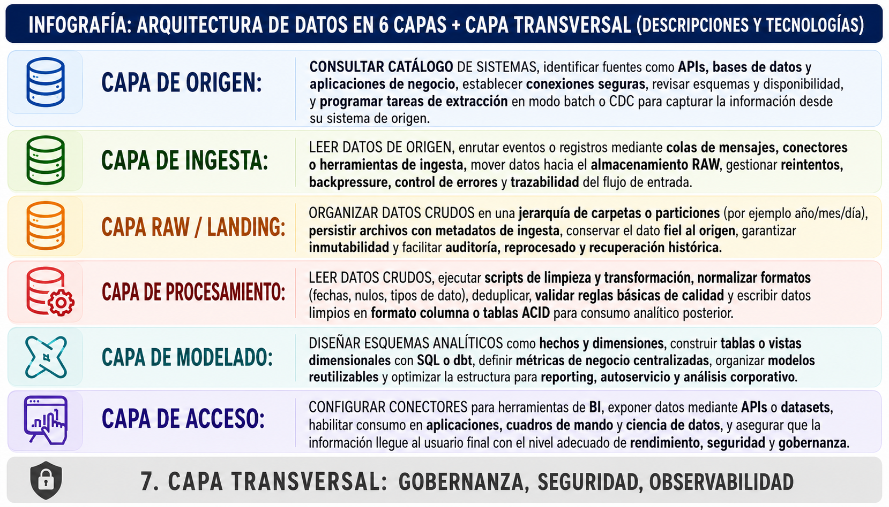
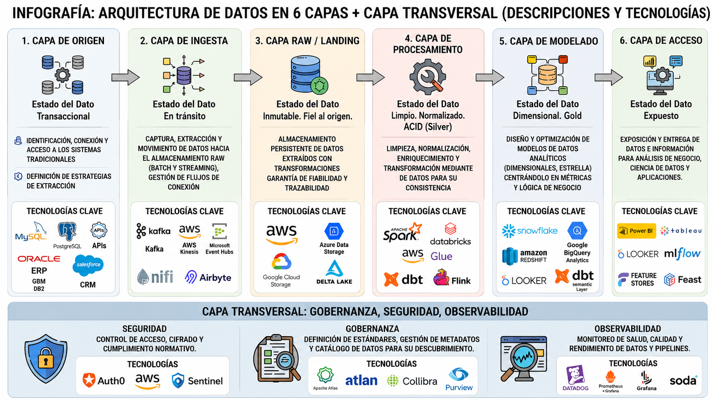

# 🏗️ Arquitectura de Datos en Azure

## 🎯 Objetivo del Proyecto
Esta arquitectura representa el flujo de datos desde su origen hasta su consumo final, pasando por distintas capas de procesamiento, almacenamiento, análisis y gobernanza dentro del ecosistema de Azure.

---

## 📊 Vista General de la Arquitectura

### 🧠 Arquitectura Completa

### 🔄 Flujo de Datos

### 🏗️ Detalle de Capas

---

## 🧩 Capas de la Arquitectura

🔵 🗄️ ORIGEN  
🔵 🚀 INGESTA  
🔵 📦 RAW / LANDING  
🔵 ⚙️ PROCESAMIENTO  
🔵 📊 MODELADO  
🔵 📈 ACCESO  
🔵 🔐 TRANSVERSAL  

---

## 🗄️ Capa de Origen
📌 Aquí nacen los datos desde sistemas empresariales como ERP, CRM o bases de datos.

---

## 🚀 Capa de Ingesta
📌 Encargada de capturar y mover los datos hacia la plataforma de análisis.

---

## 📦 Capa RAW / Landing
📌 Almacena los datos en su estado original sin transformaciones.

---

## ⚙️ Capa de Procesamiento
📌 Limpia, transforma y prepara los datos para su análisis.

---

## 📊 Capa de Modelado
📌 Organiza los datos en estructuras analíticas para el negocio.

---

## 📈 Capa de Acceso
📌 Permite el consumo de datos mediante dashboards, APIs y aplicaciones.

---

## 🔐 Capa Transversal
📌 Incluye seguridad, gobernanza y monitoreo de toda la arquitectura.

---

## 🧠 Tecnologías destacadas
- Microsoft Azure
- Microsoft Purview
- Power BI
- Apache Kafka
- Databricks
- Synapse Analytics

---

## 🔐 Gobernanza
La capa transversal asegura:
- Seguridad de los datos
- Control de acceso
- Auditoría
- Calidad y trazabilidad
