# Introduction to Microsoft Azure Data Analytics in Azure

## 1. Explore Fundamentals of Large-Scale Analytics

### Introducción

Antes de explorar cómo se construyen las soluciones de analítica a gran escala, es importante conocer las dos principales plataformas de análisis disponibles en Azure:

- **Microsoft Fabric**
- **Azure Databricks**

Ambas permiten diseñar soluciones modernas para el procesamiento y análisis de grandes volúmenes de datos, aunque cada una está orientada a distintos escenarios.

---

## Microsoft Fabric

**Microsoft Fabric** es la plataforma unificada de análisis **Software as a Service (SaaS)** de Microsoft.

Integra múltiples servicios en un único entorno de trabajo basado en navegador:

- Ingeniería de datos
- Data Warehouse
- Análisis en tiempo real
- Ciencia de datos
- Power BI

Todo ello se apoya en una capa de almacenamiento compartida denominada **OneLake**.

### Características

- No es necesario administrar servidores ni clústeres.
- Microsoft gestiona toda la infraestructura.
- Todos los servicios comparten el mismo almacenamiento.
- Experiencia totalmente integrada.

---

## Azure Databricks

**Azure Databricks** es una plataforma de análisis basada en **Apache Spark**, optimizada para:

- Ingeniería de datos a gran escala
- Ciencia de datos
- Machine Learning
- SQL Analytics

Utiliza **Delta Lake**, un formato abierto que añade funcionalidades avanzadas sobre archivos **Parquet**:

- Transacciones ACID
- Control de esquemas (*Schema Enforcement*)
- Versionado de datos (*Time Travel*)

Es un servicio administrado dentro de Azure y está especialmente orientado a equipos que trabajan mediante código y notebooks.

---

# Análisis a gran escala

Las soluciones modernas de análisis combinan dos enfoques principales:

- **Data Warehouse**
- **Big Data Analytics**

Un **Data Warehouse** almacena datos estructurados procedentes de sistemas transaccionales para facilitar consultas analíticas y procesos de Business Intelligence (BI).

Las soluciones **Big Data** permiten trabajar con:

- Grandes volúmenes de datos.
- Datos estructurados y no estructurados.
- Procesamiento por lotes (*Batch*).
- Procesamiento en tiempo real (*Streaming*).

Los datos suelen almacenarse en un **Data Lake**, donde posteriormente son procesados mediante motores distribuidos como **Apache Spark**.

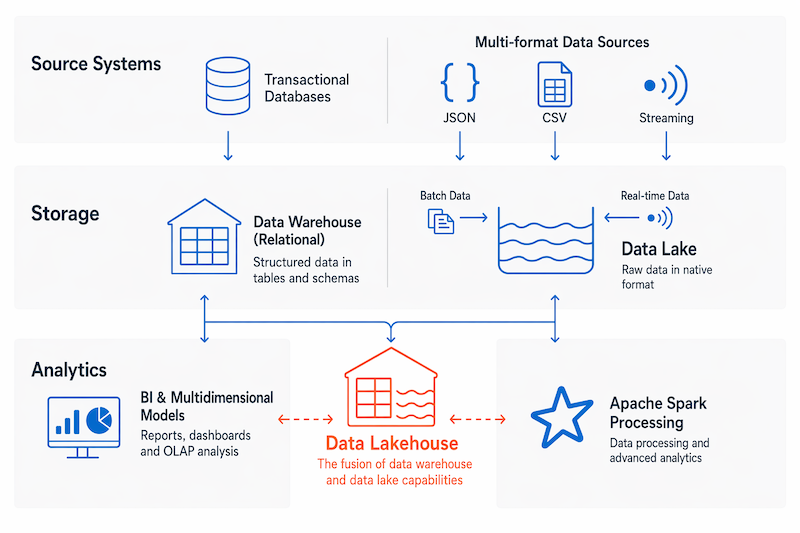

La evolución de ambos enfoques ha dado lugar al concepto de **Data Lakehouse**, que combina la flexibilidad de un Data Lake con las capacidades analíticas de un Data Warehouse.

> [!NOTE]
> Microsoft Learn ofrece este módulo tanto en formato vídeo como en formato texto. El contenido escrito suele incluir explicaciones más detalladas y sirve como material complementario.

---

# Arquitectura de almacenamiento de datos

Aunque la arquitectura puede variar según la organización, normalmente una solución de análisis a gran escala está formada por las siguientes capas:


## 1. Ingesta y procesamiento de datos

Los datos pueden proceder de múltiples orígenes:

- Bases de datos transaccionales
- Archivos
- APIs
- Sistemas externos
- Eventos en tiempo real

Durante la carga de datos se realizan procesos de:

- Extracción
- Transformación
- Limpieza
- Filtrado
- Reestructuración

Existen dos estrategias principales.

### ETL (Extract, Transform and Load)

Los datos se transforman **antes** de almacenarse.

```text
Origen → Transformación → Data Warehouse
```

### ELT (Extract, Load and Transform)

Los datos se cargan primero y posteriormente se transforman.

```text
Origen → Data Lake → Transformación
```

El procesamiento suele realizarse mediante sistemas distribuidos capaces de trabajar en paralelo sobre varios nodos.

También se distinguen dos tipos de procesamiento:

- **Batch Processing**
- **Streaming Processing**

---

## 2. Almacenamiento analítico

Existen tres modelos principales de almacenamiento:

- **Data Warehouse**
- **Data Lake**
- **Data Lakehouse**

Cada uno responde a necesidades diferentes y puede combinarse dentro de una misma solución.

---

## 3. Modelo de datos analítico

Una vez almacenados los datos, es habitual crear modelos que faciliten su explotación.

Tradicionalmente se utilizaban **cubos OLAP** mediante **SQL Server Analysis Services (SSAS)**.

Actualmente el modelo más utilizado es el **Modelo Semántico**, empleado por:

- Microsoft Fabric
- Power BI

Estos modelos incluyen:

- Tablas
- Relaciones
- Jerarquías
- Medidas DAX

En Microsoft Fabric, el modo **Direct Lake** permite consultar directamente las tablas Delta almacenadas en OneLake sin necesidad de importar los datos.

---

## 4. Visualización de datos

Los analistas consumen los datos mediante:

- Informes
- Dashboards
- KPIs
- Visualizaciones interactivas

Estas herramientas permiten:

- Analizar tendencias
- Comparar resultados
- Explorar datos
- Facilitar la toma de decisiones

Power BI es la principal herramienta de visualización dentro del ecosistema Microsoft.

---

## 5. Análisis asistido por IA

Las plataformas modernas incorporan asistentes basados en Inteligencia Artificial.

### Microsoft Fabric

Incluye **Copilot**, capaz de:

- Generar consultas SQL.
- Crear medidas DAX.
- Resumir informes.
- Explicar tendencias.
- Generar visualizaciones mediante lenguaje natural.

Power BI también dispone de la funcionalidad **Q&A**, que responde preguntas escritas en lenguaje natural.

### Azure Databricks

Incorpora **Genie**, un asistente conversacional que:

- Interpreta preguntas en lenguaje natural.
- Genera automáticamente consultas SQL.
- Ejecuta las consultas.
- Devuelve los resultados sin necesidad de escribir código.

---

# La pila moderna de analítica en Azure

Azure ofrece dos plataformas principales para implementar soluciones analíticas:

## Microsoft Fabric

Toda la plataforma gira alrededor de **OneLake**, un Data Lake compartido por todos los servicios.

Los principales componentes son:

| Servicio | Función |
|----------|---------|
| Fabric Lakehouse | Combina Data Lake y consultas SQL |
| Fabric Warehouse | Data Warehouse relacional totalmente administrado |
| Fabric Data Factory | ETL/ELT y orquestación de pipelines |
| Power BI | Informes, dashboards y modelos semánticos |

Una de sus ventajas es **Direct Lake**, que permite consultar tablas Delta directamente sin importar los datos.

---

## Azure Databricks

Azure Databricks se basa en Apache Spark y utiliza **Delta Lake** como formato de almacenamiento.

Sus principales componentes son:

| Componente | Función |
|------------|---------|
| Databricks Lakehouse | Plataforma unificada para análisis y Machine Learning |
| Databricks SQL | Consultas SQL sin servidor |
| Databricks Notebooks | Desarrollo colaborativo en Python, SQL, Scala y R |
| Unity Catalog | Gobierno y seguridad de datos |
| Genie | Consultas mediante IA y lenguaje natural |

---

# Ingesta de datos

La ingestión consiste en mover datos desde distintos orígenes hasta el almacenamiento analítico.


## Microsoft Fabric

### Fabric Data Factory

Incluye dos herramientas principales:

- **Pipelines**
- **Dataflows Gen2**

Los Pipelines permiten:

- Copiar datos.
- Ejecutar procedimientos almacenados.
- Lanzar notebooks.
- Orquestar procesos ETL y ELT.

Los Dataflows Gen2 permiten transformar datos mediante Power Query sin escribir código.

---

### OneLake Shortcuts

Permiten acceder a datos externos sin copiarlos físicamente.

Compatibles con:

- Azure Data Lake Storage Gen2
- Amazon S3
- Google Cloud Storage
- Otros espacios OneLake

---

### Fabric Mirroring

Replica automáticamente bases de datos como:

- Azure SQL Database
- Snowflake
- Azure Cosmos DB

Los datos llegan directamente a OneLake en formato Delta Lake.

---

### Eventstream

Servicio orientado al procesamiento en tiempo real.

Compatible con:

- Azure Event Hubs
- Apache Kafka
- Azure IoT Hub

---

### Fabric Notebooks

Permiten desarrollar procesos personalizados mediante:

- Python
- PySpark
- SQL
- Scala
- R

---

## Azure Data Factory

Servicio independiente para crear procesos ETL y ELT fuera de Microsoft Fabric.

Ideal para:

- Azure SQL Database
- Sistemas híbridos
- Orígenes locales

---

## Azure Databricks

Las principales opciones de ingestión son:

### Lakeflow Declarative Pipelines

Permiten construir pipelines incrementales sobre Delta Lake de forma declarativa.

### Databricks Notebooks

Permiten desarrollar procesos personalizados utilizando:

- Python
- PySpark
- SQL
- Scala
- R

---

# Almacenes de datos analíticos

## Data Warehouse

Es una base de datos relacional optimizada para consultas analíticas.

Generalmente utiliza un **Esquema Estrella (Star Schema)** formado por:

- Tablas de hechos
- Tablas de dimensiones

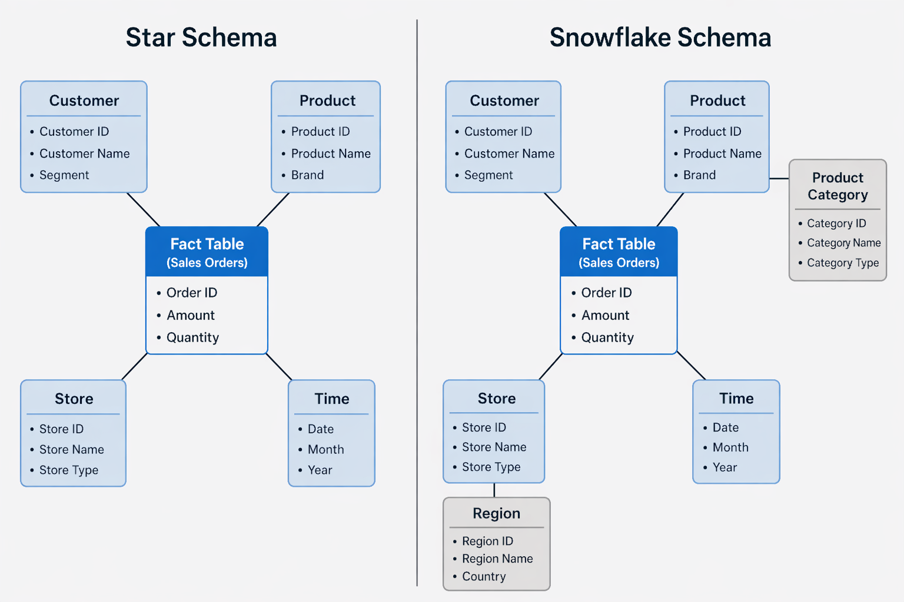

Es la mejor opción cuando:

- Los datos están estructurados.
- Se trabaja principalmente con SQL.
- Se requiere alto rendimiento en consultas analíticas.

---

## Data Lake

Un Data Lake almacena archivos de cualquier tipo.

Puede contener:

- Datos estructurados
- Datos semiestructurados
- Datos no estructurados

Utiliza el enfoque **Schema-on-Read**, donde el esquema se aplica únicamente cuando los datos son consultados.

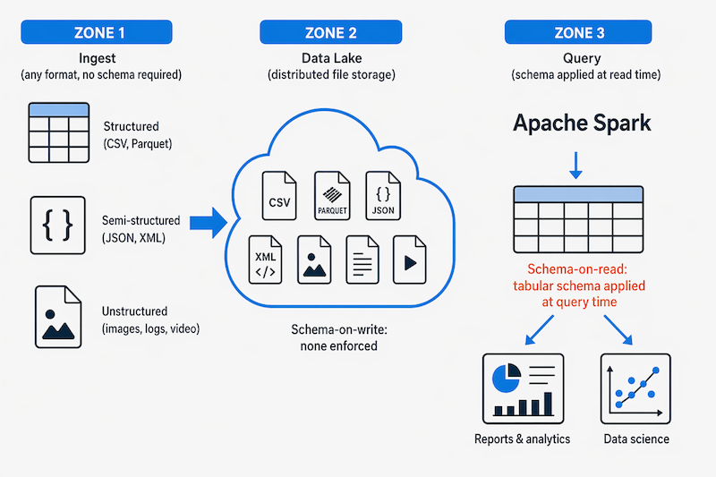

Es ideal para proyectos de Big Data y Machine Learning.

---

## Data Lakehouse

Combina las ventajas de un Data Lake y un Data Warehouse.

Características principales:

- Almacenamiento basado en archivos.
- Consultas SQL.
- Delta Lake.
- Transacciones ACID.
- Control de esquemas.
- Versionado.

En Microsoft Fabric todos los datos se almacenan en **OneLake**.


---

# Servicios de Azure para almacenamiento analítico

## Microsoft Fabric

Ofrece:

- Fabric Lakehouse
- Fabric Warehouse
- Fabric Data Factory
- OneLake
- Power BI
- Real-Time Intelligence
- Fabric Mirroring

Está especialmente orientado a organizaciones que buscan una plataforma completamente integrada.

---

## Azure Databricks

Ofrece:

- Apache Spark
- Delta Lake
- Databricks SQL
- Notebooks colaborativos
- Unity Catalog
- Genie

Es una excelente opción para equipos de ingeniería de datos y Machine Learning.

> [!NOTE]
> Muchas organizaciones combinan ambos servicios. Por ejemplo:
>
> - Azure Databricks para procesar grandes volúmenes de datos mediante Spark.
> - Microsoft Fabric Warehouse para el almacenamiento estructurado y la creación de informes con Power BI.

---

# Resumen

| Plataforma | Características principales |
|------------|-----------------------------|
| Microsoft Fabric | Plataforma SaaS integrada basada en OneLake |
| Azure Databricks | Plataforma basada en Apache Spark y Delta Lake |
| OneLake | Almacenamiento unificado de Fabric |
| Delta Lake | Formato Lakehouse con transacciones ACID |
| Apache Spark | Motor distribuido para Big Data |
| Data Warehouse | Datos estructurados para BI |
| Data Lake | Datos en cualquier formato |
| Data Lakehouse | Combina Data Lake y Data Warehouse |

---

# Conceptos clave

- Microsoft Fabric
- OneLake
- Azure Databricks
- Apache Spark
- Delta Lake
- ETL
- ELT
- Data Warehouse
- Data Lake
- Data Lakehouse
- Direct Lake
- Unity Catalog
- Copilot
- Genie
- Power BI


# Explore Fundamentals of Real-Time Analytics

## Introducción

El aumento del uso de la tecnología, los dispositivos inteligentes y la conectividad constante ha provocado un crecimiento masivo en la generación de datos. Muchos de estos datos pueden procesarse en tiempo real o casi en tiempo real como un flujo continuo, permitiendo la creación de sistemas que reaccionan de forma inmediata a los eventos.

> [!NOTE]
> Este módulo ofrece una visión conceptual del procesamiento en tiempo real y los servicios de Azure asociados. No entra en detalles de implementación.

---

# Procesamiento por lotes vs procesamiento en streaming

El procesamiento de datos convierte datos en bruto en información útil. Existen dos enfoques principales:

## Procesamiento por lotes (Batch)

Los datos se recopilan y procesan en bloques.

- Se agrupan múltiples registros
- Se procesan en un momento concreto
- Puede ser por tiempo o por volumen

### Ejemplo

Contar coches en una carretera como si se recogieran en un aparcamiento antes de analizarlos.

<p align="center">
  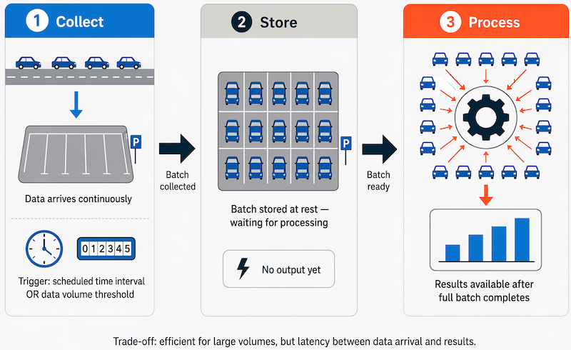
</p>

### Ventajas

- Alto rendimiento con grandes volúmenes
- Uso eficiente del sistema
- Permite procesamientos programados

### Desventajas

- Alta latencia
- No hay resultados inmediatos
- Errores pueden afectar a todo el lote

---

## Procesamiento en streaming

Los datos se procesan individualmente a medida que llegan.

- Procesamiento en tiempo real
- Sin esperar a lotes
- Ideal para eventos continuos

### Ejemplo

Contar coches en tiempo real mientras pasan.

<p align="center">
  
</p>

### Casos reales

- Bolsa en tiempo real
- Videojuegos online
- Recomendaciones basadas en geolocalización

---

## Diferencias clave

| Aspecto | Batch | Streaming |
|----------|------|----------|
| Latencia | Alta (horas) | Baja (ms/segundos) |
| Datos | Históricos completos | Datos recientes |
| Uso | Análisis complejo | Respuesta inmediata |
| Procesamiento | Grandes volúmenes | Eventos individuales |

---

# Arquitectura combinada (Lambda)

Muchas soluciones combinan ambos enfoques:

<p align="center">
  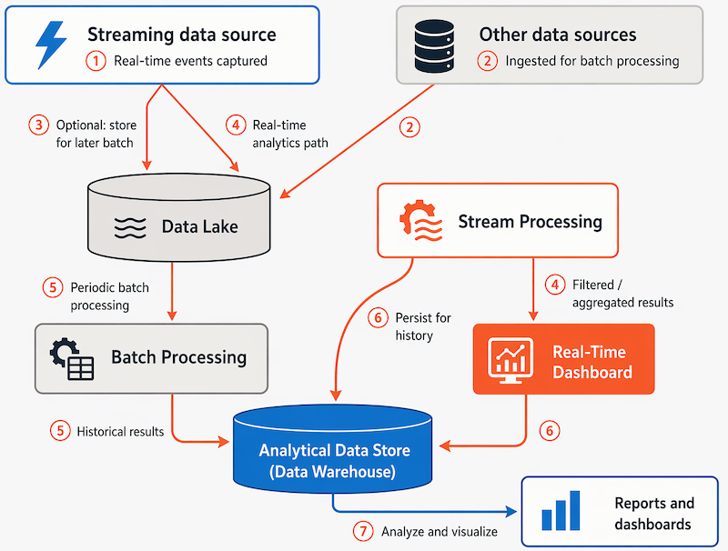
</p>

## Flujo general

- Los datos en streaming se capturan en tiempo real
- Los datos batch se almacenan para análisis histórico
- Ambos se combinan para análisis completo

## Nota

> [!NOTE]
> La arquitectura Kappa es una alternativa moderna que trata todo como streaming continuo.

---

# Arquitectura de procesamiento en streaming

Una arquitectura típica incluye:

<p align="center">
  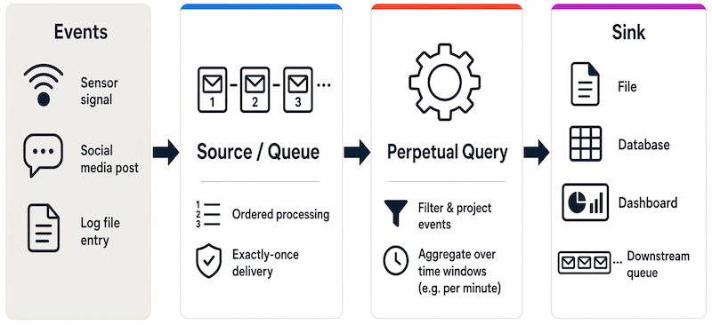
</p>

## Componentes

### 1. Fuente de eventos

- Sensores
- Logs
- Redes sociales
- Aplicaciones

### 2. Ingesta de datos

Puede ser:

- Cola de mensajes
- Azure Event Hubs
- Azure IoT Hub

### 3. Procesamiento

- Filtros
- Agregaciones
- Ventanas temporales

### 4. Salida (sink)

- Bases de datos
- Dashboards
- Archivos
- Colas

---

# Servicios de análisis en tiempo real en Azure

## Microsoft Fabric Real-Time Intelligence

Incluye un conjunto completo de herramientas:

- Eventstream
- Eventhouse
- Real-Time Dashboards
- Activator

<p align="center">
  
</p>

### Características

- Ingesta en tiempo real
- Consultas con KQL
- Dashboards en vivo
- Automatización de acciones

---

## Azure Stream Analytics

- Servicio PaaS
- Procesamiento de flujos con consultas SQL
- Integración con múltiples fuentes

---

## Spark Structured Streaming

Permite tratar flujos como tablas dinámicas.

### Funcionamiento

1. Conexión a fuente de streaming
2. Datos en DataFrame continuo
3. Consulta en tiempo real
4. Salida a sink

<p align="center">
  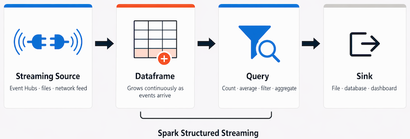
</p>

---

## Delta Lake

Formato de almacenamiento que mejora los Data Lakes.

### Características

- Transacciones ACID
- Control de esquemas
- Batch + streaming unificado

### Ventajas

- Consistencia de datos
- Fiabilidad
- Integración con Spark

---

# Fuentes de datos en streaming

- Azure Event Hubs
- Azure IoT Hub
- Azure Data Lake Storage Gen2
- Apache Kafka

---

# Destinos (sinks)

- Azure SQL Database
- Microsoft Fabric
- Power BI
- Azure Data Lake Storage
- Azure Blob Storage

---

# Resumen

El procesamiento en tiempo real permite reaccionar inmediatamente a los eventos, complementando el análisis histórico basado en batch.

---

# Conceptos clave

- Batch Processing
- Stream Processing
- Lambda Architecture
- Kappa Architecture
- Event Hubs
- IoT Hub
- KQL
- Spark Structured Streaming
- Delta Lake
- Microsoft Fabric Real-Time Intelligence

---

# 📊 Explore Fundamentals of Data Visualization

> [!NOTE]
> La visualización de datos es una parte clave de la Business Intelligence (BI), ya que permite transformar datos complejos en información visual para la toma de decisiones.

---

# 🖥️ Microsoft Power BI

Microsoft Power BI es la principal herramienta de Business Intelligence de Microsoft. Permite crear informes interactivos y modelos de datos a partir de múltiples fuentes.

<p align="center">
  
</p>

## 🔄 Flujo de trabajo de Power BI

El flujo típico en Power BI es:

```text
Conectar datos → Transformar → Modelar → Visualizar → Publicar
```

### Fases principales:

- **Conexión de datos**: múltiples orígenes (SQL, Excel, Azure, APIs, etc.)
- **Transformación**: limpieza y preparación con Power Query
- **Modelado**: relaciones, tablas, medidas y jerarquías con DAX
- **Visualización**: creación de gráficos e informes
- **Publicación**: compartición en Power BI Service

---

# ☁️ Power BI en Microsoft Fabric

Power BI está integrado en Microsoft Fabric, compartiendo almacenamiento en **OneLake**.

### Características clave en Fabric:

- **Espacios de trabajo**: colaboración en la nube.
- **Modelos semánticos**: estructura de datos reutilizable.
- **Direct Lake**: consulta directa a datos en OneLake sin importación.
- **Edición web**: creación de informes sin Power BI Desktop.

---

# 🤖 IA en Power BI

Power BI incluye capacidades de inteligencia artificial para facilitar el análisis.

## Copilot en Power BI

- Resume informes automáticamente.
- Genera páginas de informes.
- Crea medidas DAX con lenguaje natural.

## Otras funciones de IA

- **Narrativas inteligentes**: resumen automático de visualizaciones.

---

# 🧠 Modelado de datos

El modelado de datos organiza la información para su análisis.

## Medidas y dimensiones

- **Medidas**: valores numéricos (ventas, ingresos, cantidad).
- **Dimensiones**: categorías (cliente, producto, tiempo).

---

## 📐 Esquema estrella (Star Schema)

Modelo más común en BI:

- Tabla de hechos (datos numéricos)
- Tablas de dimensiones (contexto)

<p align="center">
  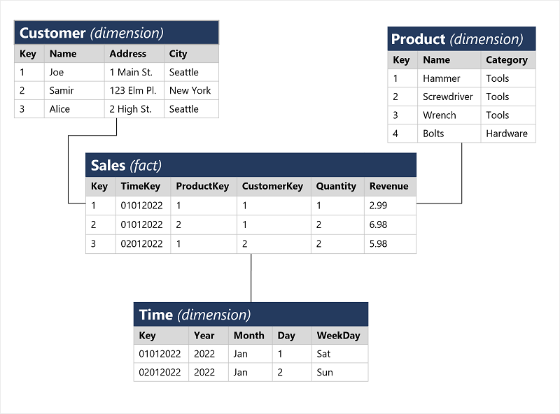
</p>

## 📌 Esquema copo de nieve

Variante del esquema estrella con dimensiones normalizadas.

---

## 🕒 Jerarquías

Permiten analizar datos por niveles:

- Tiempo: Año → Mes → Día
- Productos: Categoría → Subcategoría → Producto
- Ubicación: País → Ciudad

<p align="center">
  
</p>

---

## 🧩 Modelo semántico en Power BI

Define:

- Tablas
- Relaciones
- Jerarquías
- Medidas DAX

<p align="center">
  
</p>

> [!TIP]
> Power BI usa el motor en memoria VertiPaq para consultas rápidas.

---

# 📈 Tipos de visualización

## 📋 Tablas y tarjetas

- Muestran datos detallados o métricas clave.

<p align="center">
  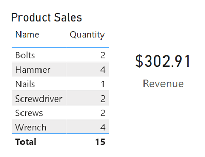
</p>

---

## 📊 Gráficos de barras y columnas

- Comparación entre categorías.

<p align="center">
  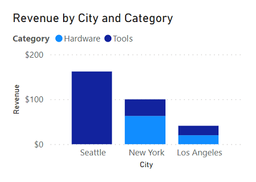
</p>

---

## 📉 Gráficos de líneas

- Tendencias a lo largo del tiempo.

<p align="center">
  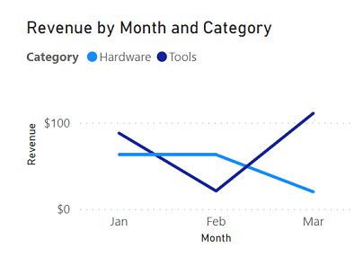
</p>

---

## 🥧 Gráficos circulares

- Proporciones de un total.

<p align="center">
  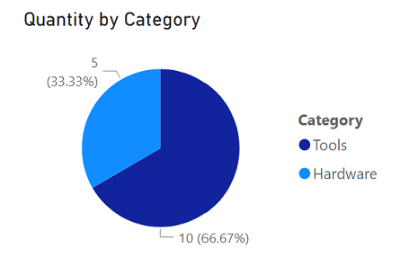
</p>

---

## 📍 Diagramas de dispersión

- Relación entre dos variables.

<p align="center">
  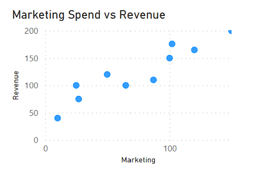
</p>

---

## 🌍 Mapas

- Análisis geográfico de datos.

<p align="center">
  
</p>

---

# 🔄 Informes interactivos

En Power BI, las visualizaciones están conectadas entre sí:

- Seleccionar un dato filtra el resto del informe.
- Permite exploración dinámica de la información.

<p align="center">
  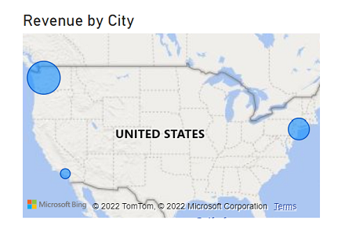
</p>

---

# 🤖 Visualizaciones con IA

Power BI incluye herramientas inteligentes:

- **Narrativas automáticas**: explicaciones de gráficos.
- **Q&A**: preguntas en lenguaje natural.
- **Influenciadores clave**: factores que afectan métricas.
- **Árbol de descomposición**: análisis detallado de causas.

---

# 📌 Resumen

Power BI permite transformar datos en información visual interactiva. Integrado con Microsoft Fabric, ofrece modelado, análisis e inteligencia artificial para mejorar la toma de decisiones.

---

# 🧠 Conceptos clave

- Business Intelligence (BI)
- Microsoft Power BI
- Power Query
- DAX
- Modelo semántico
- Esquema estrella
- Jerarquías
- VertiPaq
- Direct Lake
- Visualización de datos
- Dashboards
- Copilot
