# Laboratorio: Exploración de Azure SQL Database

## Introducción

En este laboratorio se crea una base de datos en Azure SQL, se configuran recursos en la nube y se realizan consultas SQL básicas y avanzadas para comprender el funcionamiento de bases de datos relacionales.

---

# Creación de base de datos Azure SQL

1. Inicio de sesión en Azure.
2. Crear recurso.
3. Buscar Azure SQL.

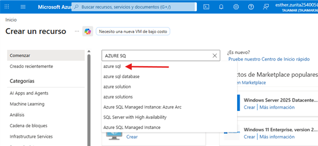

*Figura 1. Búsqueda de Azure SQL.*

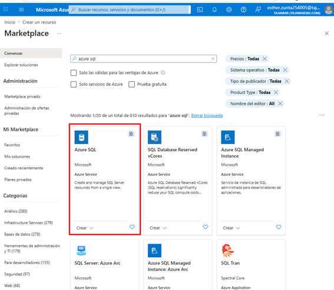

*Figura 2. Selección de Azure SQL.*

4. Crear recurso.

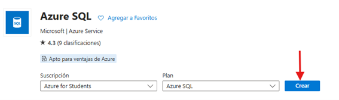

*Figura 3. Crear Azure SQL.*

5. Configuración básica:
   - Grupo de recursos nuevo
   - Nombre: Dealership

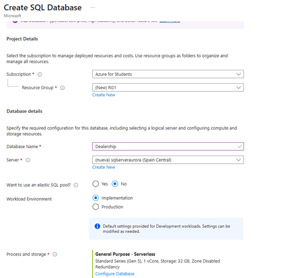

*Figura 4. Configuración base.*

---

6. Servidor SQL:

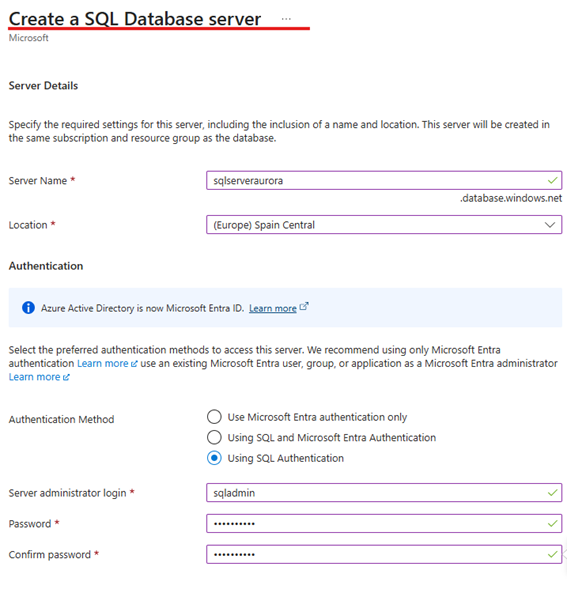

*Figura 5. Configuración del servidor.*

---

7. Networking:

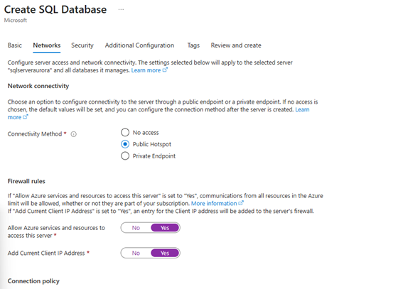

*Figura 6. Configuración de red.*

---

8. Seguridad:

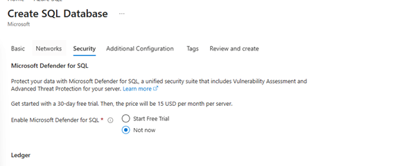

*Figura 7. Seguridad.*

---

9. Ajustes adicionales:

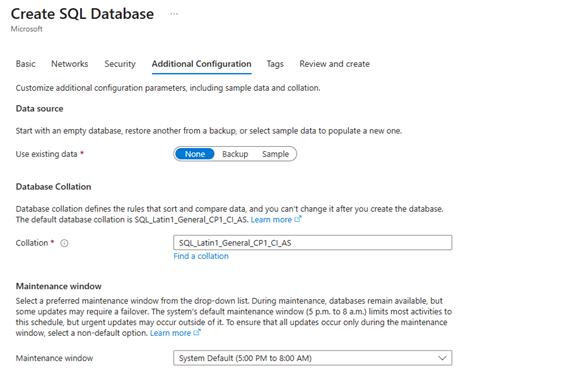

*Figura 8. Ajustes adicionales.*

---

10. Revisión:

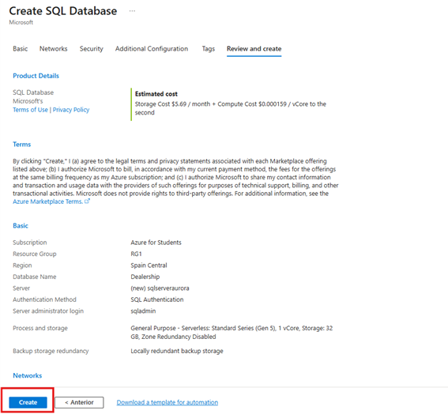

*Figura 9. Revisión.*

---

11. Despliegue:

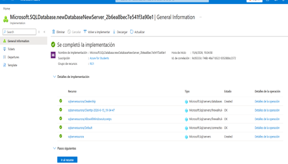

*Figura 10. Resultado del despliegue.*

---

# Base de datos y consultas

12. Editor de consultas:

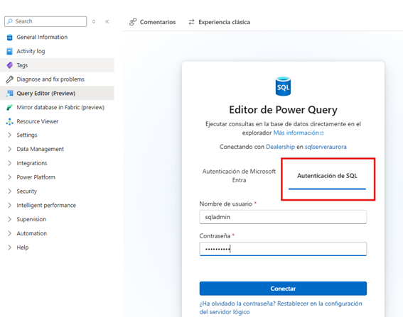

*Figura 11. Editor SQL.*

---

13. Creación de tablas:

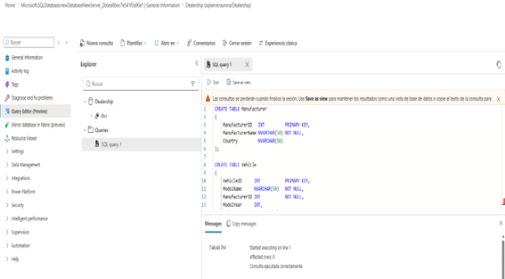

*Figura 12. Creación de tablas en la base de datos.*

---

14. Inserción de datos:

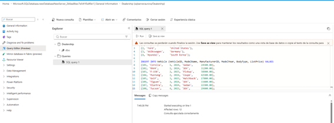

*Figura 13. Inserción de datos.*

---

15. Consulta SELECT:

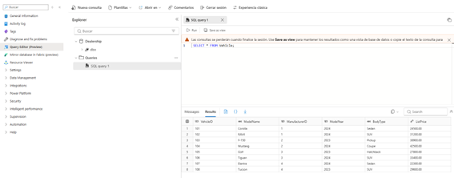

*Figura 14. Consulta de datos.*

---

16. Filtrado de datos:

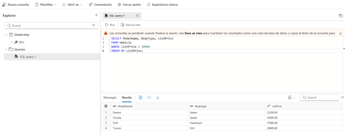

*Figura 15. WHERE + ORDER BY.*

---

17. JOIN entre tablas:

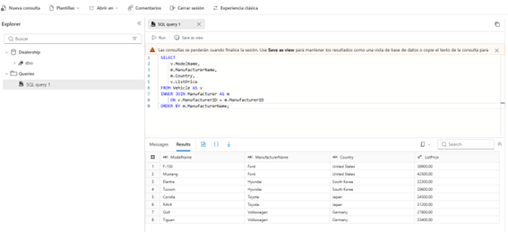

*Figura 16. Consulta JOIN.*

---

18. Consulta con filtro avanzado:

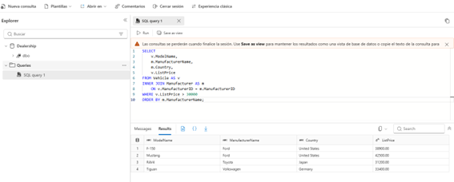

*Figura 17. Filtrado de precios superiores a 30000.*

---

# Limpieza de recursos

19. Eliminación del grupo de recursos:

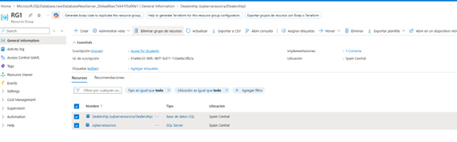

*Figura 18. Eliminación de recursos.*

20. Confirmación de eliminación:

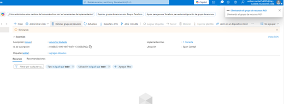

*Figura 19. Recursos eliminados correctamente.*

---

# Conclusión

En este laboratorio se ha creado una base de datos en Azure SQL, configurado un servidor, creado tablas relacionales e insertado datos de ejemplo. Posteriormente, se han realizado consultas SQL básicas, filtrado de datos y consultas avanzadas utilizando JOIN.

Finalmente, se eliminaron los recursos creados para evitar costes en la nube y completar correctamente el ciclo del laboratorio.

---

# Nota final

Este laboratorio demuestra el uso de Azure SQL Database para gestionar datos en la nube y el uso de SQL para consultar información de forma eficiente en un entorno relacional.
