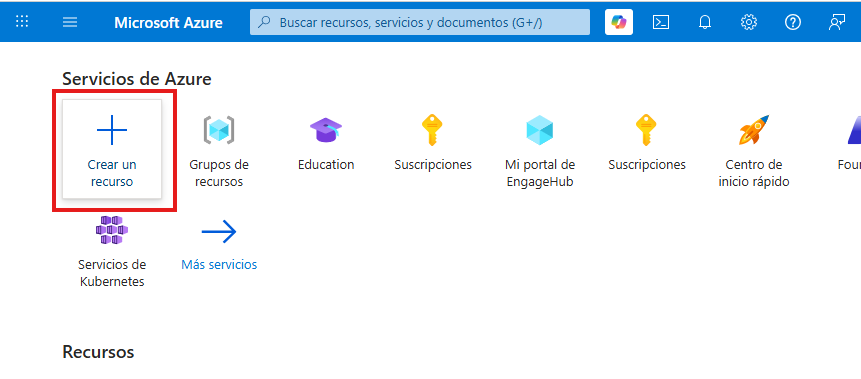
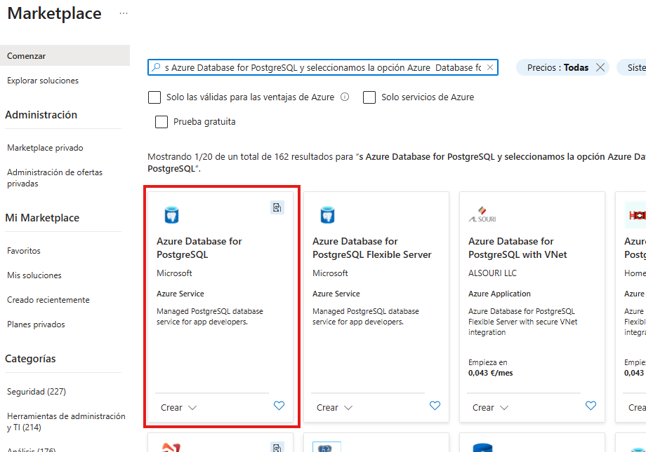
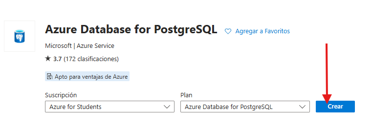
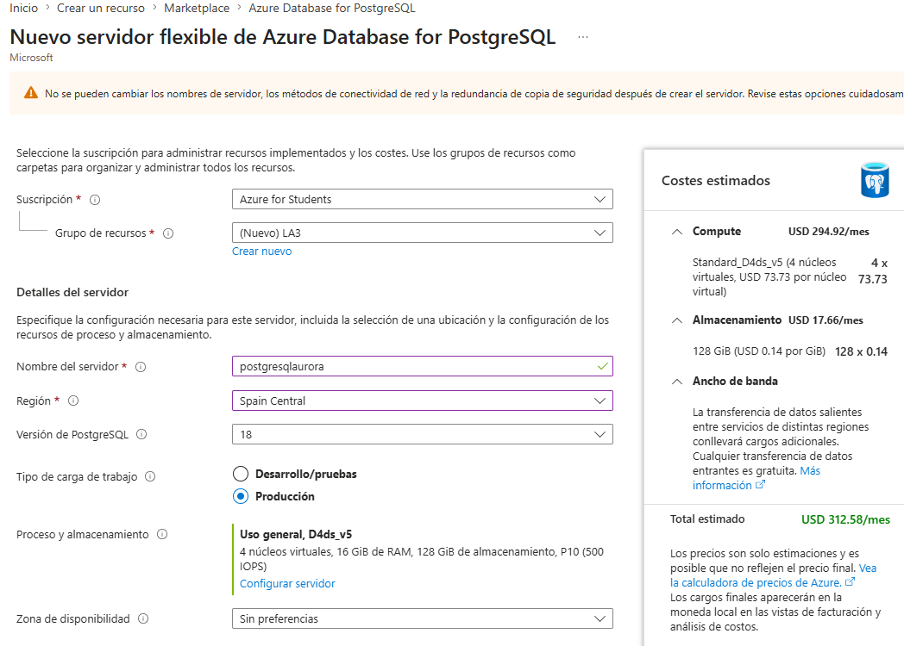
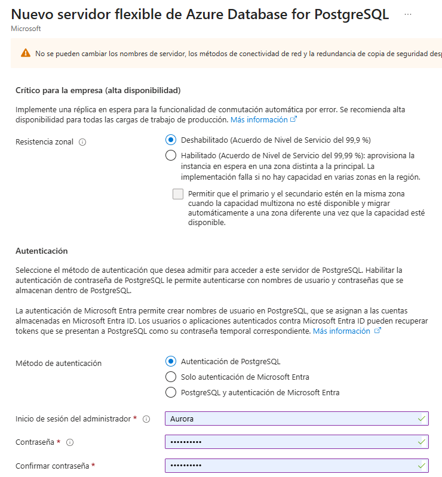
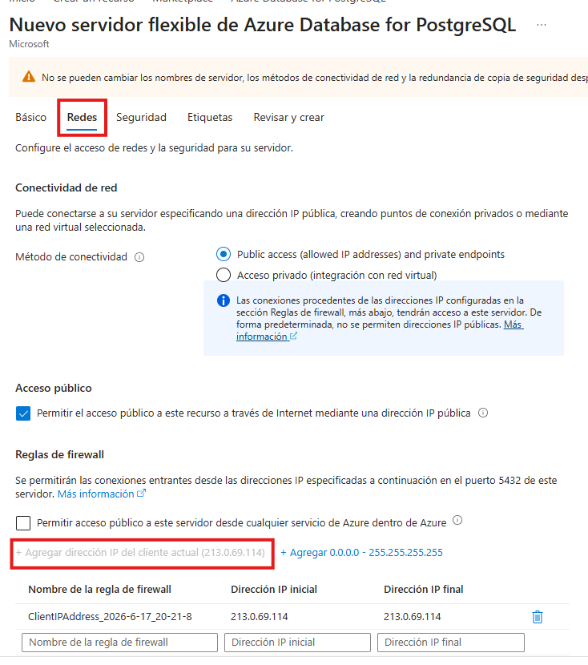
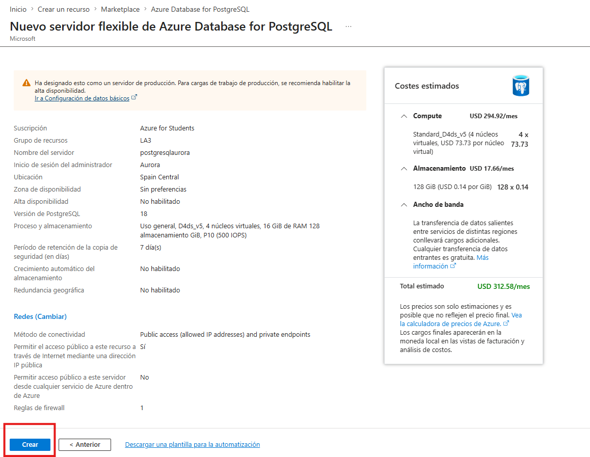
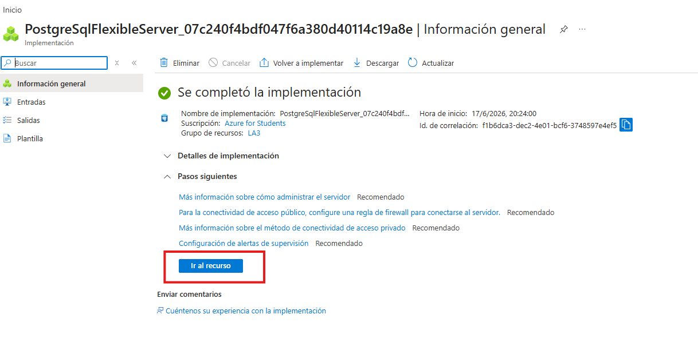
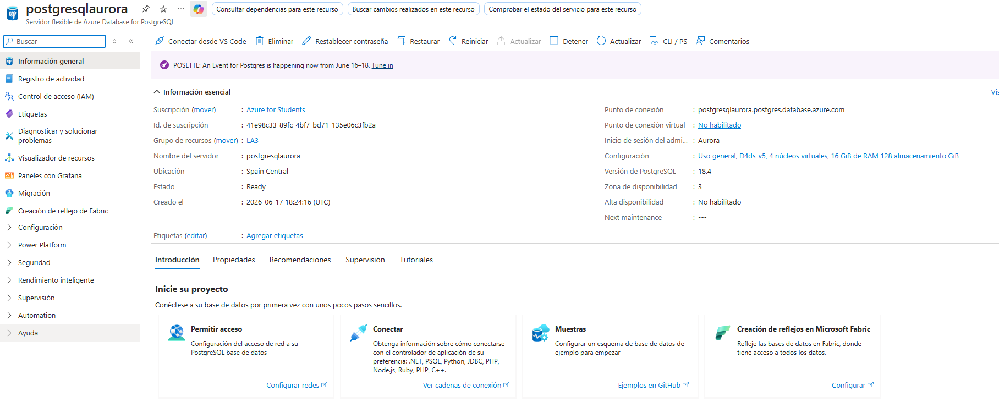

# LABORATORIO: Creación y uso de una base de datos en Azure Database for PostgreSQL

## Introducción
En este laboratorio se realiza la creación y configuración de una base de datos en la nube utilizando **Azure Database for PostgreSQL**. El objetivo es aprender a desplegar un servidor de base de datos, configurarlo correctamente y habilitar el acceso desde una red externa.

---

## Objetivo
Crear y configurar un servidor de PostgreSQL en Azure, estableciendo los parámetros básicos de red, seguridad y acceso al recurso.

---

## Desarrollo del laboratorio (paso a paso)

### Paso 1: Acceso al portal de Azure
Se accede al portal de Azure e iniciamos sesión con nuestras credenciales para poder gestionar los recursos.

---

### Paso 2: Creación del recurso PostgreSQL
En el portal, seleccionamos **Crear un recurso**.  

Buscamos **Azure Database for PostgreSQL** y seleccionamos la opción correspondiente.  
Después hacemos clic en **Crear**.

---

### Paso 3: Configuración del recurso
Se rellenan los campos de configuración del servidor:

- Nombre del servidor  
- Tipo de suscripción  
- Grupo de recursos (nuevo o existente)  
- Región o ubicación

  
- Versión de PostgreSQL  
- Tipo de autenticación  

En la sección de redes, se agrega la IP actual para permitir el acceso desde el equipo local.  

Finalmente, se selecciona **Revisar y crear**.

---

### Paso 4: Implementación del recurso
Se espera a que Azure complete la creación del servidor de base de datos.

---

### Paso 5: Acceso al recurso
Una vez finalizada la implementación, se accede al servidor mediante la opción **“Ir al recurso”**, donde se pueden gestionar todas las configuraciones.

---

## Conclusión
Se ha conseguido crear correctamente un servidor **Azure Database for PostgreSQL**, configurando los parámetros básicos de red y acceso. Este proceso permite comprender el despliegue de bases de datos en la nube y su administración desde el portal de Azure.
