# LABORATORIO: Creación de una base de datos Azure Database for MySQL

## Introducción
En este laboratorio se ha realizado la creación y configuración de un servidor de bases de datos en la nube mediante **Azure Database for MySQL (Servidor Flexible)**. El objetivo es aprender a desplegar un servicio de base de datos, configurarlo correctamente y habilitar el acceso desde un equipo local.

## Objetivo
Crear y configurar un servidor de MySQL en Azure, aplicando reglas de red básicas y completando el proceso de despliegue desde el portal de Azure.

---

## Desarrollo del laboratorio (paso a paso)

### Paso 1: Acceso al portal de Azure y creación del recurso
Se accede al portal de Azure y se selecciona la opción **“Crear un recurso”**.  

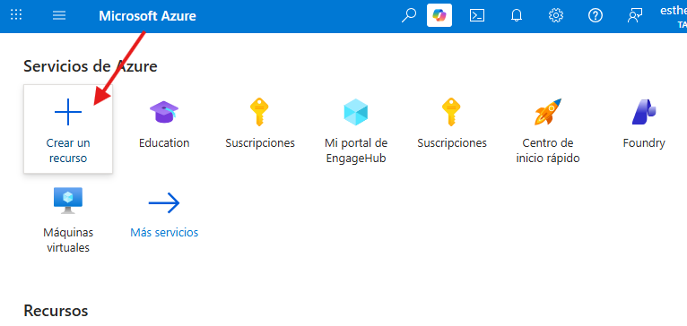

En el buscador se escribe *Azure Database for MySQL* y se selecciona la opción correspondiente.

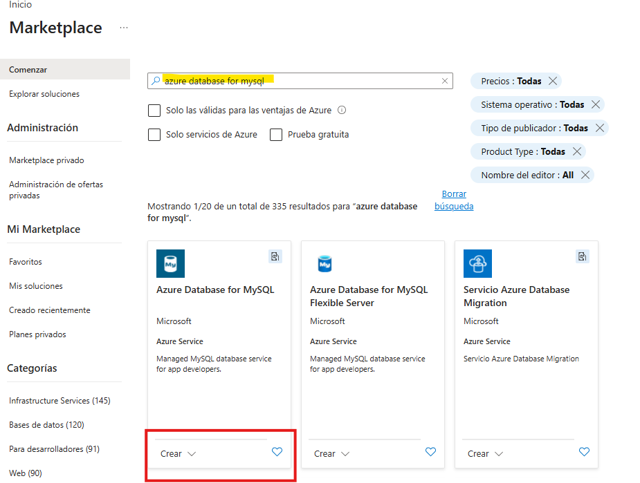

Y creamos.

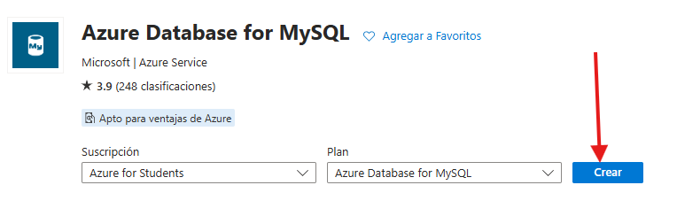

---

### Paso 2: Selección del tipo de recurso
Se elige **Servidor Flexible** como tipo de despliegue.  
Luego se selecciona la opción de **Creación avanzada** para una configuración completa.

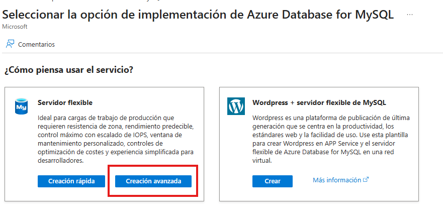

---

### Paso 3: Configuración de la base de datos
Se rellenan los siguientes campos:

- Suscripción activa de Azure  
- Grupo de recursos nuevo  
- Nombre único del servidor  
- Región cercana  
- Versión de MySQL (por defecto)  
- Tipo de carga: desarrollo

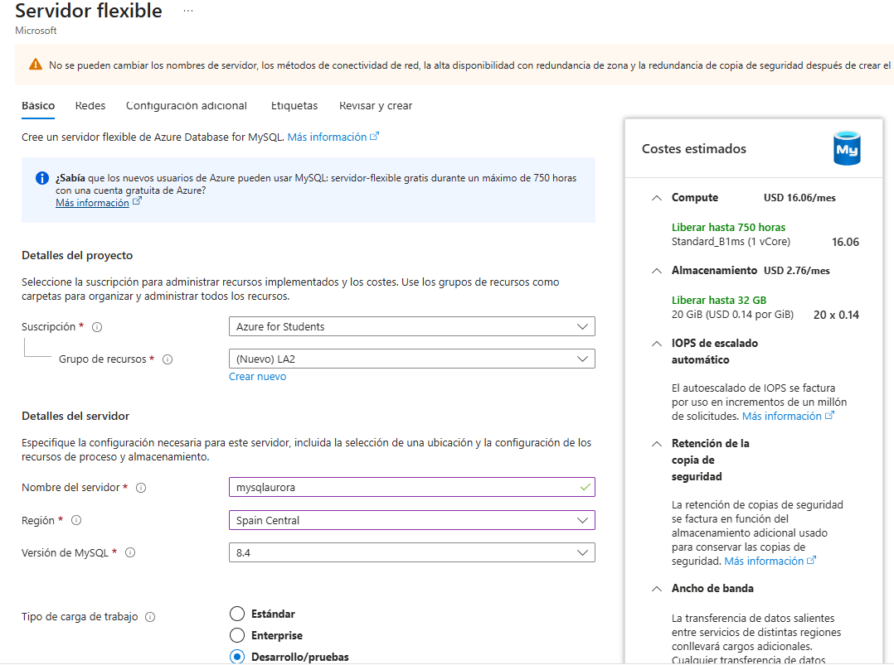

- Usuario administrador y contraseña  

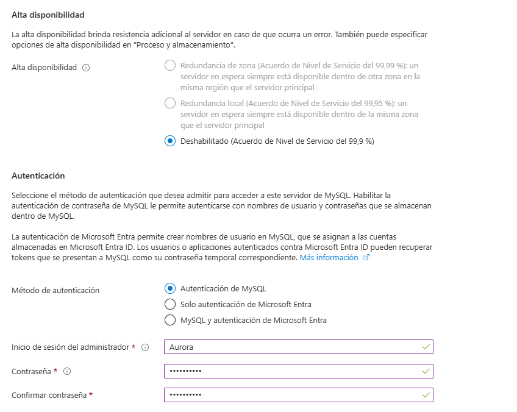

Luego se continúa a la sección de redes.

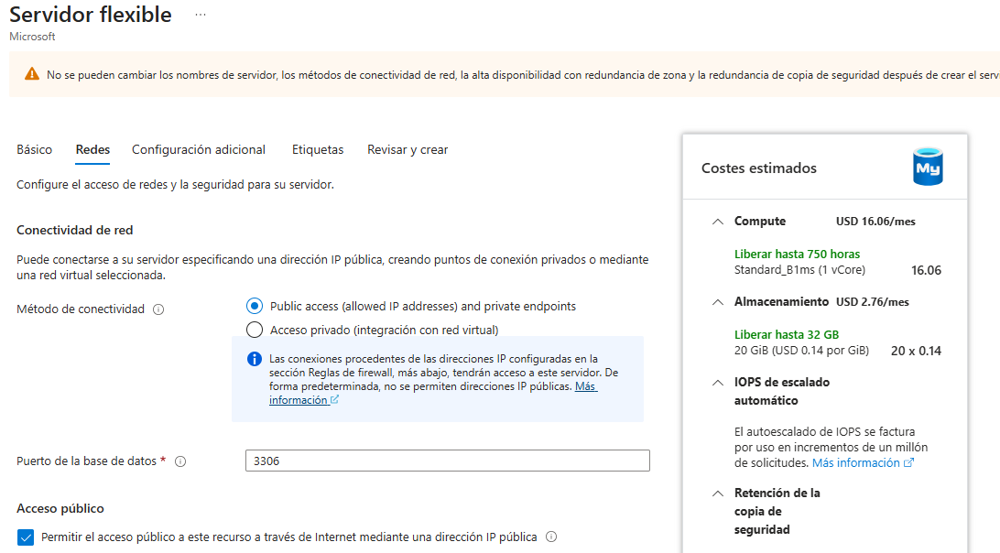

---

### Paso 4: Configuración de red y firewall
Se agrega la IP del cliente actual para permitir el acceso desde el equipo local.

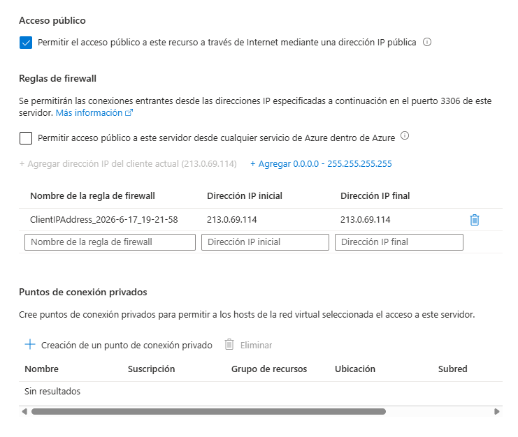

---

### Paso 5: Revisión y creación
Se revisa toda la configuración y se selecciona **“Crear”** para iniciar el despliegue del servidor.

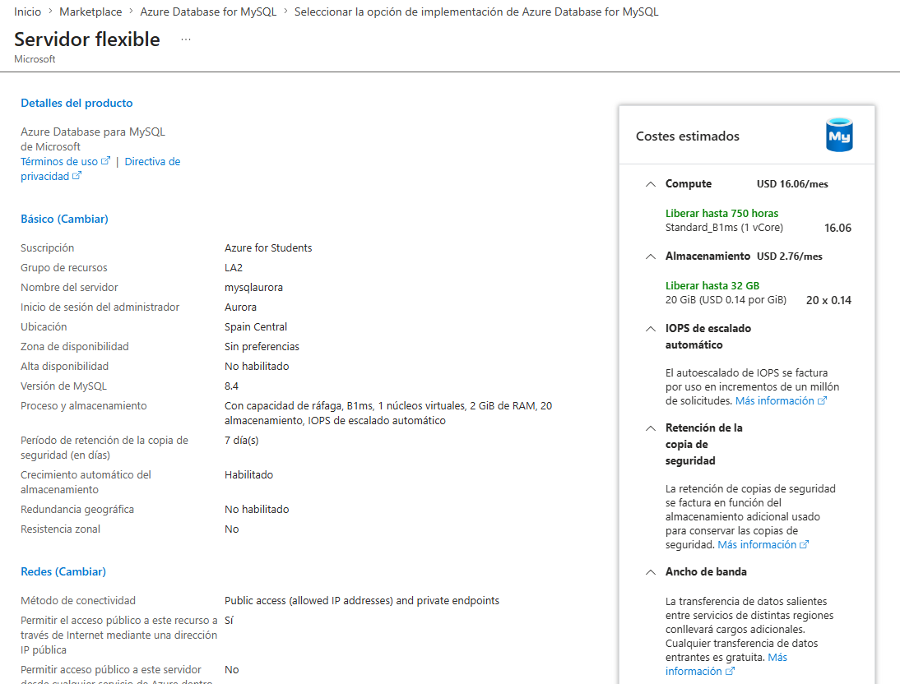

---

### Paso 6: Despliegue del recurso
Se espera a que finalice la implementación del servidor MySQL en Azure.

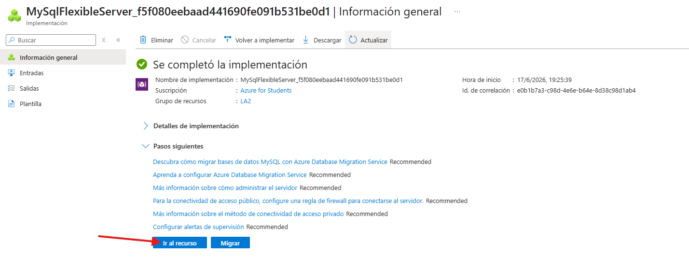

---

### Paso 7: Acceso al recurso
Una vez creado, se accede al recurso para ver sus opciones de administración, configuración y conexión.

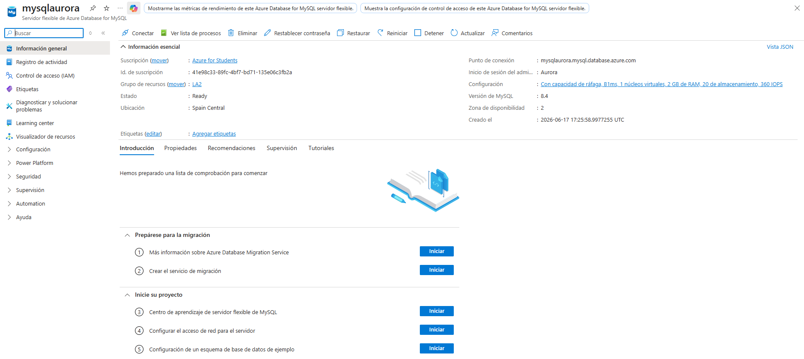

---

## Conclusión
Se ha conseguido desplegar correctamente un servidor **Azure Database for MySQL**, configurando red, seguridad y parámetros básicos. Este proceso permite entender cómo se gestionan bases de datos en la nube de forma profesional y escalable.
