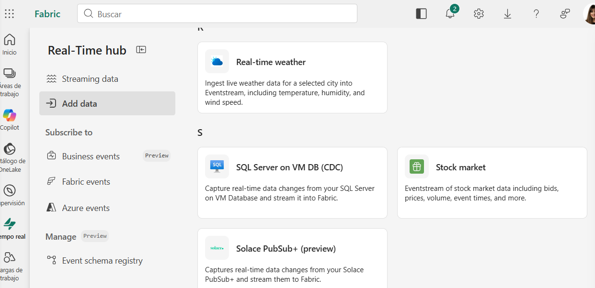
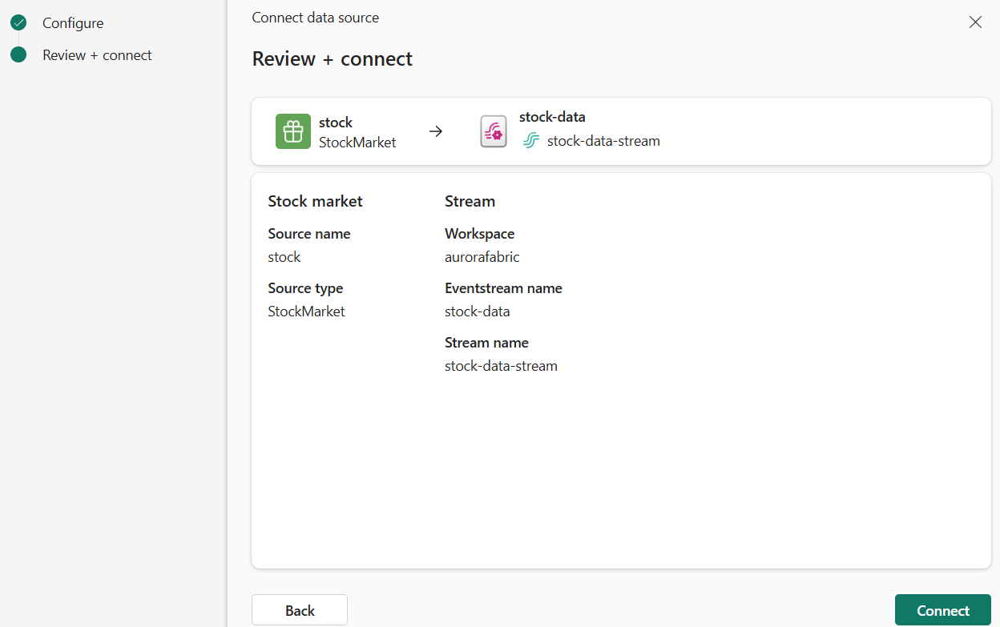
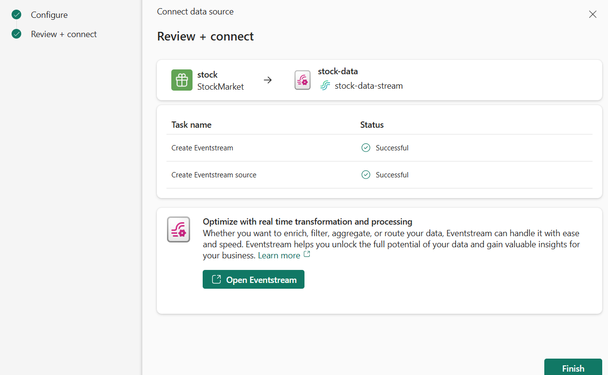
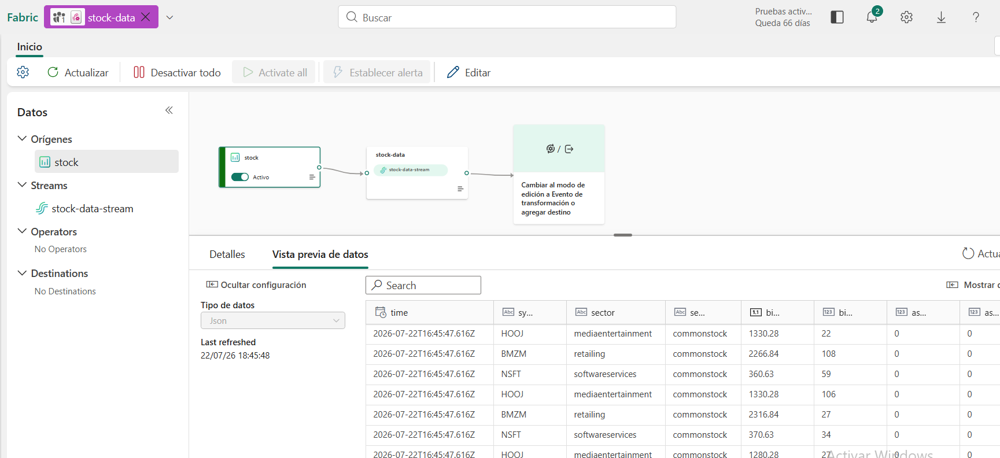

# Introducción a Real-Time Intelligence en Microsoft Fabric


# Objetivo

En este laboratorio se aprenderá a utilizar las capacidades de **Real-Time Intelligence** de Microsoft Fabric para:

- Crear un Workspace.
- Ingerir datos en tiempo real mediante Eventstream.
- Almacenar los datos en un Eventhouse.
- Consultar información mediante KQL.
- Crear un Dashboard en tiempo real.
- Configurar una alerta utilizando Activator.

---

# Paso 1. Crear un Workspace

Entramos en:

https://app.fabric.microsoft.com

Iniciamos sesión con nuestra cuenta de Microsoft Fabric.

En el menú izquierdo seleccionamos **Workspaces** y pulsamos **New Workspace**.

Configuramos:

- **Nombre:** aurorafabric
- **Licencia:** Fabric Trial / Premium / Fabric

Cuando termine aparecerá el Workspace vacío.

## Captura

> *(Insertar captura del Workspace recién creado)*

---

# Paso 2. Crear un Eventstream

En el menú izquierdo abrimos:

**Real-Time Hub**

Seleccionamos:

**Add data**

Elegimos:

**Sample data → Stock Market**

Configuramos:

| Campo | Valor |
|--------|-------|
| Source Name | stock |
| Workspace | Nuestro Workspace |
| Eventstream | stock-data |

Pulsamos:

- Next
- Connect
- Open Eventstream

Comprobaremos que aparece el flujo de datos en el lienzo.

## Captura




---

# Paso 3. Crear un Eventhouse

Desde el menú izquierdo seleccionamos:

**Create → Eventhouse**




Asignamos un nombre al Eventhouse.

Una vez creado veremos:

- Eventhouse
- Base de datos KQL
- Queryset

## Captura

> *(Insertar captura del Eventhouse vacío)*

---

# Paso 4. Crear la tabla donde almacenar los datos

Dentro del Eventhouse pulsamos:

**Get Data**

Seleccionamos:

Eventstream → Existing Eventstream

Configuramos:

| Campo | Valor |
|--------|-------|
| Tabla | stock |
| Workspace | Nuestro Workspace |
| Eventstream | stock-data |
| Connection | stock-table |

Pulsamos **Next** hasta finalizar el asistente.

Al terminar veremos creada la tabla **stock**.

## Captura

> *(Insertar captura de la tabla creada)*

---

# Paso 5. Verificar el flujo

Volvemos al:

**Real-Time Hub**

Abrimos nuevamente el Eventstream.

Ahora aparecerá un nuevo destino conectado al flujo.

Esto confirma que los datos se están almacenando correctamente.

## Captura

> *(Insertar captura del Eventstream con el destino conectado)*

---

# Paso 6. Consultar los datos

Abrimos la base de datos KQL.

Entramos en el **Queryset**.

Ejecutamos la siguiente consulta:

```kusto
stock
| take 100
```

Obtendremos las primeras 100 filas almacenadas.

## Captura

> *(Insertar captura de la consulta)*

---

# Paso 7. Obtener el precio medio

Ejecutamos la siguiente consulta:

```kusto
stock
| where ["time"] > ago(5m)
| summarize avgPrice = avg(todecimal(bidPrice)) by symbol
| project symbol, avgPrice
```

Esta consulta obtiene el precio medio de cada acción durante los últimos cinco minutos.

Al volver a ejecutarla observaremos cómo los valores cambian continuamente al recibirse nuevos datos.

## Captura

> *(Insertar captura del resultado)*

---

# Paso 8. Crear un Dashboard

Seleccionamos la consulta anterior.

Pulsamos:

**Save to Dashboard**

Configuramos:

| Campo | Valor |
|--------|-------|
| Dashboard | Stock Dashboard |
| Tile | Average Prices |

Abrimos el Dashboard creado.

## Captura

> *(Insertar captura del Dashboard)*

---

# Paso 9. Cambiar la visualización

Entramos en modo **Edit**.

Editamos el Tile.

En **Visual Format** cambiamos:

- Table
- Column Chart

Aplicamos los cambios.

Ahora el Dashboard mostrará un gráfico de columnas.

## Captura

> *(Insertar captura del gráfico)*

---

# Paso 10. Crear una alerta

Desde el Dashboard seleccionamos:

**Set Alert**

Configuramos:

| Parámetro | Valor |
|-----------|-------|
| Ejecutar consulta | Cada 5 minutos |
| Agrupar por | symbol |
| Campo | avgPrice |
| Condición | Increases by |
| Valor | 100 |
| Acción | Send me an email |

Creamos la alerta.

## Captura

> *(Insertar captura de la configuración de la alerta)*

---

# Paso 11. Comprobar el Activator

Regresamos al Workspace.

Veremos un nuevo elemento correspondiente al **Activator**.

Lo abrimos.

Accedemos al historial de la alerta.

Si el precio de alguna acción aumenta más de 100 unidades, la alerta quedará registrada y se enviará un correo electrónico.

## Captura

> *(Insertar captura del Activator)*

---

# Paso 12. Limpieza de recursos

Para eliminar todos los recursos creados:

Workspace → Settings → Delete this Workspace

Confirmamos la eliminación.

## Captura

> *(Insertar captura antes de eliminar el Workspace)*

---

# Conclusiones

En este laboratorio se ha aprendido a utilizar las capacidades de **Real-Time Intelligence** de Microsoft Fabric para trabajar con información en tiempo real.

Se han realizado correctamente las siguientes tareas:

- Creación de un Workspace.
- Configuración de un Eventstream.
- Creación de un Eventhouse.
- Ingesta de datos en tiempo real.
- Consultas mediante KQL.
- Creación de un Dashboard.
- Configuración de alertas mediante Activator.

Gracias a estas herramientas, Microsoft Fabric permite construir soluciones de análisis y monitorización en tiempo real de forma sencilla e integrada.
