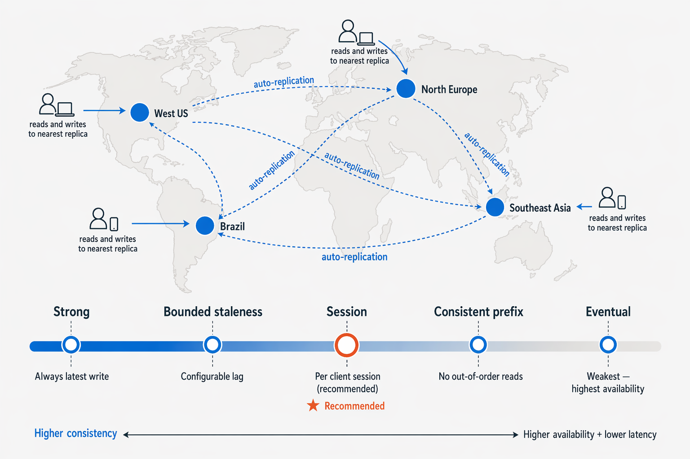

--

# 🚀 Azure Cosmos DB 

# 🧠 1. Introducción

Las bases de datos relacionales son rígidas.

NoSQL permite:

- 📄 Documentos
- 🔑 Clave-valor
- 🕸️ Grafos
- 📊 Columnas

---

# ⚙️ 2. ¿Qué es Azure Cosmos DB?

:contentReference[oaicite:1]{index=1} es un servicio PaaS:

✔ Sin servidores  
✔ Escalado automático  
✔ Backups automáticos  
✔ Alta disponibilidad  

---

# 🧠 IMPORTANTE

👉 Cosmos DB = NoSQL global distribuida con baja latencia, escalado horizontal y consistencia configurable.

👉 Todo en Cosmos DB gira alrededor de:
- RU/s (coste y rendimiento)
- Particiones (escala)
- Regiones (global)
- Consistencia (precisión vs disponibilidad)

---

👉 IDEA CLAVE:
Cosmos DB NO es solo una base de datos → es un sistema distribuido global.

---

# 🏗️ 3. Arquitectura de datos

## Estructura

1. Cuenta  
2. Base de datos  
3. Contenedor  
4. Items  

---

## 🔑 Clave de partición (🔥 MUY IMPORTANTE)

👉 Distribuye datos entre particiones

👉 Cada partición = hasta 20 GB

👉 Define rendimiento del sistema

❌ Mala clave → hot partitions (problemas de rendimiento)  
✔ Buena clave → escalabilidad y equilibrio

---

## 🧠 NOTA DE EXAMEN

👉 Si hay mala partición:
- El sistema se sobrecarga en una sola partición
- Baja el rendimiento global

---

## 🖼️ Arquitectura

---

# 🌍 4. Distribución global

- Replicación automática
- Multi-región
- Lectura desde región más cercana

---

## ⚡ Latencia

- Lecturas: ~4 ms  
- Escrituras: ~5 ms  

---

## 🧠 NOTA DE EXAMEN

👉 Global no significa gratis:
- Más regiones = más coste RU/s

---

## 🖼️ Global

---

# 📏 5. Consistencia (🔥 EXAMEN TOP)

| Nivel | Descripción |
|------|-------------|
| 🔴 Fuerte | siempre datos actuales |
| 🟠 Estancamiento acotado | retraso controlado |
| 🟡 Sesión | ⭐ más usado |
| 🔵 Prefijo consistente | orden correcto |
| ⚪ Eventual | máxima disponibilidad |

---

## 🧠 NOTA DE EXAMEN

👉 Sesión = nivel recomendado en la mayoría de apps

---

# 💰 6. RU/s

- 1 RU ≈ lectura de 1 KB
- Todo consumo cuesta RU

---

## 🧠 NOTA DE EXAMEN

👉 RU/s = coste + rendimiento

👉 Si suben consultas → suben RU

---

# ⚙️ 7. Modelos de rendimiento

| Modelo | Descripción |
|--------|-------------|
| 🟢 Dedicado | un contenedor |
| 🟡 Compartido | hasta 25 contenedores |
| 🔵 Serverless | pago por uso |

---

## 🧠 NOTA DE EXAMEN

👉 Serverless = solo 1 región

---

## 🖼️ Rendimiento

---

# 🔌 8. APIs de Cosmos DB

:contentReference[oaicite:2]{index=2} soporta:

- NoSQL (nativa)
- MongoDB 🍃
- Table 📊
- Cassandra 🧱
- Gremlin 🕸️

---

## 🧠 IDEA CLAVE

👉 API = compatibilidad  
👉 Motor = el mismo Cosmos DB

---

## 🧠 NOTA DE EXAMEN

👉 Puedes migrar MongoDB / Cassandra con cambios mínimos

---

## 🖼️ APIs

---

# 🕸️ 9. GRAFOS (Gremlin)

- Vértices = nodos
- Aristas = relaciones

---

## 🧠 NOTA DE EXAMEN

👉 Grafos = ideal para:
- redes sociales
- fraude
- recomendaciones

---

## 🖼️ Grafos

---

# 📌 10. CUÁNDO USAR COSMOS DB

✔ IoT 📡  
✔ Gaming 🎮  
✔ E-commerce 🛒  
✔ Apps web/móviles 📱  

---

# ❌ 11. CUÁNDO NO USARLO

- ❌ JOINs complejos → Azure SQL Database  
- ❌ Analítica histórica → Azure Synapse / Microsoft Fabric  

---

# 🧠 12. RESUMEN FINAL

:contentReference[oaicite:3]{index=3} es:

✔ Global  
✔ NoSQL  
✔ Multi-API  
✔ Escalable  
✔ Baja latencia  
✔ Basado en RU/s  
✔ Consistencia configurable  

---

# 🚀 FRASE FINAL

👉 “Cosmos DB es una base de datos NoSQL global distribuida diseñada para baja latencia y escalabilidad horizontal con consistencia configurable.”
