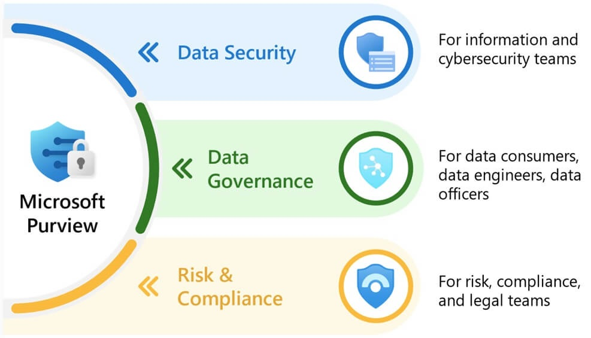
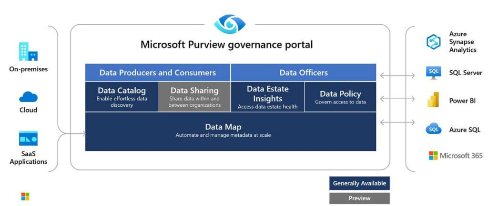
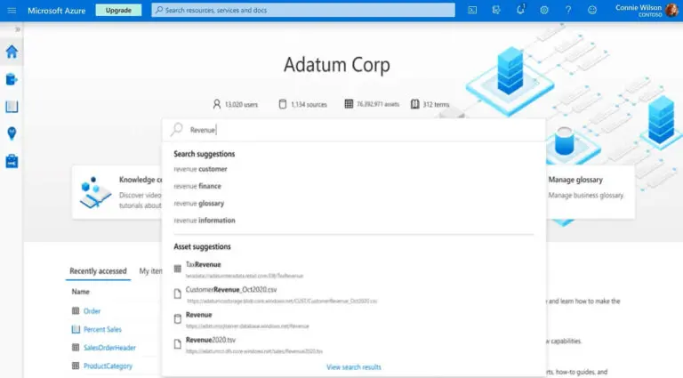
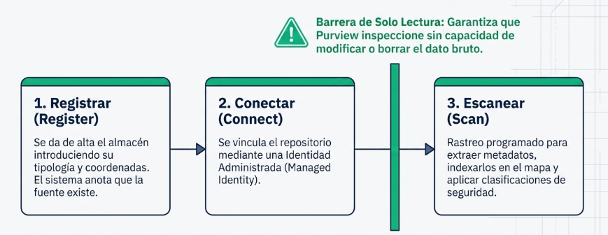
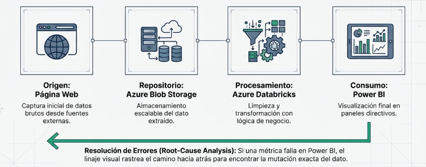

<p align="center">
  
</p>

<h1 align="center">MICROSOFT PURVIEW</h1>

<h2 align="center">Gobernanza y Gestión de Datos en la Nube con Microsoft Purview</h2>

<p align="center">
  <strong>AUTOR:</strong> Aurora
</p>

<hr>


# ¿Qué es Microsoft Purview y cuál es su origen?

Microsoft Purview es la plataforma unificada de **Gobernanza de Datos (Data Governance)**, **seguridad** y **cumplimiento normativo (Compliance)** de Microsoft. Toda su gestión se realiza de forma centralizada desde el **Microsoft Purview Governance Portal**.



### Origen y evolución

- Antes (Azure Purview): gobernanza y catalogación de datos  
- Ahora (Microsoft Purview): añade cumplimiento normativo, protección de datos y gestión de riesgos

## Filosofía No Intrusiva

Purview no duplica los archivos de la organización ni los mueve de su almacenamiento original; actúa como un auditor externo que inspecciona los repositorios directamente donde están almacenados.

## Arquitectura Híbrida y Multicloud

Aunque es un servicio nativo de Azure, Purview dispone de conectores para escanear de forma centralizada:

- Amazon AWS S3
- Google BigQuery
- Servidores On-Premises
- Oracle
- SAP

---

# Los Componentes Operativos de Microsoft Purview



## Mapa de Datos (Data Map) y Sistema de Colecciones

El **Data Map** es el núcleo e infraestructura fundamental de Purview. Automatiza el descubrimiento de activos mediante el escaneo de metadatos.


### Estructura Organizativa

Las colecciones son contenedores lógicos organizados en forma de árbol que representan departamentos o regiones geográficas.

### Control de Acceso Interno

Las colecciones definen las fronteras de seguridad y el aislamiento de datos.

Ejemplo:

```text
Colección Raíz (Empresa)
├── Colección Finanzas
│   ├── Datos Bancarios
│   └── Facturas
└── Colección Marketing
    ├── Campañas
    └── Métricas Web
```

---

## Catálogo de Datos (Data Catalog) y Glosario de Negocio

El **Data Catalog** es la interfaz gráfica y portal de búsqueda orientado a usuarios finales.


 

### Mapeo y Traducción de Términos

Permite asociar términos empresariales a activos técnicos.

Ejemplo:

```text
"Ingresos Trimestrales"
        ↓
Fact_Sales_Q3_Final
```

Así, cualquier usuario puede encontrar información sin conocer SQL ni la infraestructura subyacente.

---

# Clasificación, Etiquetado de Sensibilidad e Insights

## Clasificación

Purview analiza los datos durante el escaneo e identifica información sensible usando más de 200 patrones predefinidos:

- Tarjetas de crédito
- Pasaportes
- Documentos de identidad
- Registros médicos
- Datos protegidos por RGPD

## Etiquetas de Sensibilidad

Son marcas de protección que:

- Cifran documentos.
- Restringen accesos.
- Bloquean la salida de datos si se detecta riesgo.

## Purview Estate Insights

Panel ejecutivo que proporciona:

- Informes
- Gráficos
- Métricas agregadas
- Visibilidad de riesgos
- Estado de cumplimiento

---

# Intercambio Seguro: Microsoft Purview Data Sharing

Permite compartir datos **in-situ** (en el origen) sin crear copias físicas.

Beneficios:

- Evita duplicación de datos.
- Mantiene el control centralizado.
- Conserva el linaje.
- Respeta las políticas de gobierno.

---

# Roles y Permisos basados en Gobierno de Purview

## Data Source Admin (Infraestructura)

Perfil de usuario común: 

- Ingeniero de Datos
  
Responsable de:

- Registrar fuentes de datos.
- Configurar credenciales.
- Definir escaneos automáticos.

## Data Curator (contexto y calidad)

Perfil de usuario común: 

- Data Steward
  
Responsable de:

- Gestionar el Glosario de Negocio.
- Añadir descripciones.
- Aprobar términos empresariales.
- Asociar términos a activos técnicos.

## Data Reader (consumo)

Perfil de usuario común: 

- Analista de Negocio
- Usuario Final
  
Responsable de:

- Consultar el catálogo.
- Leer descripciones.
- Consultar el linaje.

No puede modificar configuraciones ni metadatos.

---

# Proceso de Ingesta Técnica en el Data Map

## 1. Register

Registrar el almacén o base de datos en Purview.

## 2. Connect

Conectar mediante autenticación segura:

- Managed Identity
- Permisos de solo lectura

Garantiza que Purview no puede modificar ni eliminar datos.

## 3. Scan

Escaneo automático para:

- Extraer metadatos.
- Indexarlos.
- Aplicar clasificaciones.



---

# Caso de Uso Práctico: Data Lineage

## Auditoría del Camino del Dato

Purview registra automáticamente el recorrido completo de la información.

Ejemplo:

```text
Página Web
     ↓
Azure Blob Storage
     ↓
Azure Databricks
     ↓
Power BI
```

Permite conocer:

- Origen del dato.
- Transformaciones realizadas.
- Consumo final.

## Resolución de Errores

Si una métrica falla en Power BI:

1. Se consulta el linaje.
2. Se rastrea el recorrido hacia atrás.
3. Se localiza el origen exacto del error.



## Buenas prácticas (Best Practices)

- Definir correctamente las colecciones desde el inicio
- Automatizar escaneos periódicos
- Aplicar clasificaciones y etiquetas de sensibilidad de forma consistente
- Controlar accesos con el principio de mínimo privilegio
- Mantener actualizado el glosario de negocio

...


# Conclusión Estratégica

## Marco Zero Trust

Microsoft Purview permite aplicar el principio:

> Nunca confiar, siempre verificar.

Automatiza:

- Descubrimiento
- Clasificación
- Protección

de todo el patrimonio de datos corporativo.

## Garantía de Cumplimiento

Permite detectar datos sensibles expuestos antes de que ocurra una brecha de seguridad y ayuda a cumplir normativas como:

- RGPD
- Legislaciones de privacidad internacionales
- Requisitos de auditoría corporativa

---

# Memoria Visual

## Si la pregunta del examen describe esta necesidad sobre Gobierno de Datos:

| Necesidad | Respuesta |
|------------|------------|
| Buscar fuentes de datos indexadas usando términos de negocio cotidianos | **Data Catalog de Purview** |
| Descubrir y mapear automáticamente activos de información en la nube | **Data Map de Purview** |
| Organizar las fuentes en contenedores lógicos y gestionar permisos | **Colecciones (Collections) de Purview** |
| Registrar fuentes de datos y configurar escaneos | **Data Source Admin de Purview** |
| Editar el Glosario de Negocio y gestionar metadatos | **Data Curator de Purview** |
| Usuarios finales que buscan información en el catálogo | **Data Reader de Purview** |
| Analizar el recorrido de un dato | **Data Lineage (Linaje de Datos) de Purview** |
| Compartir datos sin duplicar archivos | **Microsoft Purview Data Sharing** |
| Información que extrae Purview de los archivos | **Únicamente los metadatos (nunca el contenido bruto)** |
| Detectar números de tarjetas, DNI, etc. | **Clasificaciones de Purview** |
| Aplicar cifrado o restricciones de acceso a un archivo según su confidencialidad. | **Etiquetas de Sensibilidad de Purview** |

---

# Frases Clave para Memorizar

> Purview es un sistema no intrusivo: es el encargado de hacer el inventario de toda la empresa sin mover jamás un solo archivo de su sitio original.

> El Catálogo de Purview actúa como el Google empresarial: permite que un directivo busque el término de negocio "Ventas" y el sistema le encuentre la tabla técnica correspondiente sin que el usuario sepa programación.

> En el modelo de seguridad Zero Trust, las Clasificaciones de Purview encuentran los datos sensibles en la sombra y las Etiquetas de Sensibilidad les ponen el candado automático.

> Con Data Sharing, Purview elimina el riesgo de duplicar archivos para compartirlos; ahora la información se consume in-situ bajo el ojo vigilante del portal central.
